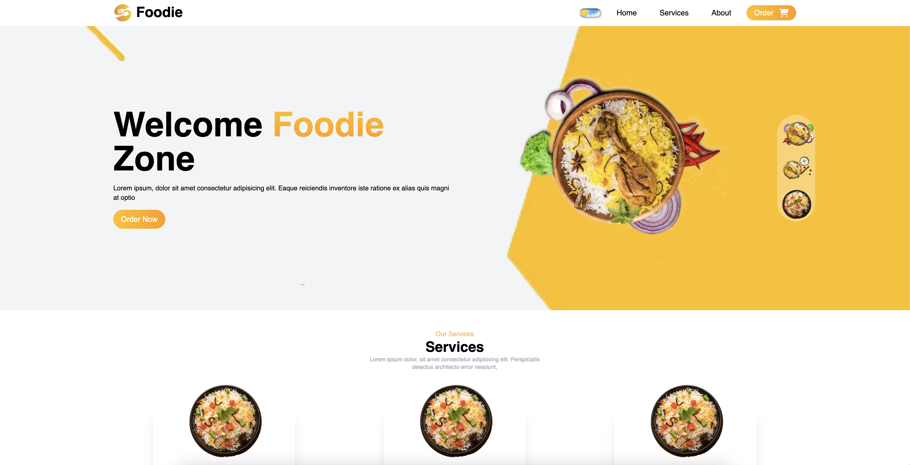
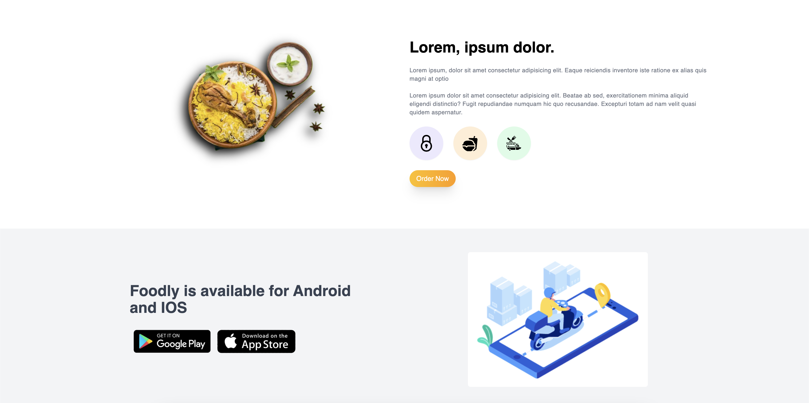
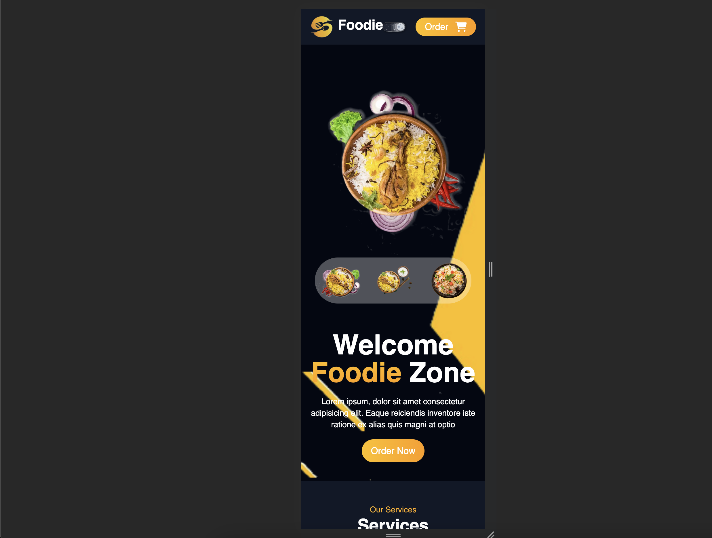

# Restaurant Website

Welcome to the official repository of our restaurant website! This project showcases a modern and interactive website for our restaurant, providing visitors with information about our menu, location, and more.

## Features

- **Interactive Menu:** Browse through our diverse menu with mouth-watering dishes.
- **Reservation System:** Easily book a table for your dining experience.
- **Contact Information:** Find our location and contact details for inquiries.

## Screenshots

### Homepage


### Menu


### Reservation


## Technologies Used

- Frontend: React.js
- Styling: Tailwind CSS
- State Management: Redux
- ...

## Getting Started

1. **Clone the Repository:**
   ```bash
   git clone https://github.com/your-username/restaurant-website.git
